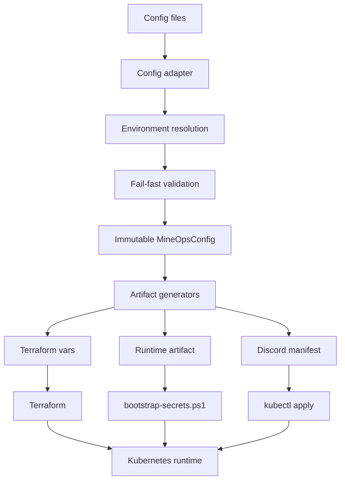

# MineOps

<p align="center">

</p>

MineOps is a self-hosted Minecraft platform for running one or more isolated server instances on a local Kubernetes cluster.

It treats `mineops.yaml` as the external single source of truth, converts that input into an immutable `MineOpsConfig` domain model, generates deployment artifacts, and reconciles infrastructure deterministically.

## Features

- Multi-instance deployments with per-instance namespaces
- `mineops.yaml` SSOT with environment-variable substitution
- Instance-aware CLI commands with `--instance` and `--all`
- Deterministic deployment through generated Terraform variables and runtime artifacts
- Discord ChatOps for status, alerts, and guarded lifecycle actions
- Playit tunnel integration for public player access
- Safe backups, manual restore, and world import workflows
- Idempotent `mineops init` reconciliation

## Architecture At A Glance



MineOps is documented as a platform, not as a single deployment script. Start with the quick start, then use the architecture and developer guides as needed.

## Quick Start

1. Install Docker Desktop, `k3d`, `kubectl`, Terraform, Node.js 20+, and PowerShell.
2. Create a `mineops.yaml` file and keep secrets in environment variables.
3. Run `mineops validate`.
4. Run `mineops init`.
5. Inspect the result with `mineops status --all` and `mineops doctor --all`.

Detailed setup is in [installation](docs/getting-started/installation.md) and [quick start](docs/getting-started/quick-start.md).

## Documentation

- Getting started
  - [Installation](docs/getting-started/installation.md)
  - [Quick Start](docs/getting-started/quick-start.md)
  - [First Server](docs/getting-started/first-server.md)
- User guide
  - [mineops.yaml](docs/user-guide/mineops-yaml.md)
  - [Multi-instance](docs/user-guide/multi-instance.md)
  - [Commands](docs/user-guide/commands.md)
- Operator guide
  - [Day-2 Operations](docs/operator-guide/day-2-operations.md)
  - [Backup And Restore](docs/operator-guide/backup-and-restore.md)
  - [Troubleshooting](docs/operator-guide/troubleshooting.md)
- Architecture
  - [Overview](docs/architecture/overview.md)
  - [Deployment Pipeline](docs/architecture/deployment-pipeline.md)
  - [Configuration System](docs/architecture/configuration-system.md)
  - [Infrastructure](docs/architecture/infrastructure.md)
  - [Runtime](docs/architecture/runtime.md)
  - [Storage](docs/architecture/storage.md)
  - [Networking](docs/architecture/networking.md)
  - [Service Descriptors](docs/architecture/service-descriptors.md)
- Developer guide
  - [Project Structure](docs/developer-guide/project-structure.md)
  - [Configuration Adapters](docs/developer-guide/configuration-adapters.md)
  - [Deployment Planner](docs/developer-guide/deployment-planner.md)
  - [Adding A Service](docs/developer-guide/adding-a-service.md)
  - [Testing](docs/developer-guide/testing.md)
- Migration
  - [Legacy To mineops.yaml](docs/migration/legacy-to-mineops-yaml.md)
  - [Upgrading](docs/migration/upgrading.md)
- ADRs
  - [ADR Index](docs/adr/README.md)

## Repository Layout

```text
apps/
  discord-bot/       Discord ChatOps service
  mineops-cli/       Operator CLI, config model, generators, orchestration
  utils/             Shared utilities
docs/                User, operator, architecture, developer, and migration docs
infra/
  k3d/               Local cluster definition
  terraform/         Terraform for Minecraft, Playit, backup, and namespace resources
platform/
  kubernetes/        Static platform manifests and reference resources
scripts/             Runtime bootstrap, restore, and validation scripts
mineops.yaml         External platform SSOT
```

## Design Principles

- MineOps is a platform, not a script.
- `MineOpsConfig` is the internal domain model.
- `mineops.yaml` is the external SSOT.
- Only adapters read configuration files.
- Infrastructure consumes generated artifacts.
- Validation fails fast before infrastructure mutation.
- Configuration is immutable after model construction.
- Deployment is deterministic and idempotent.
- Multi-instance and namespace isolation come first.

## Development Workflow

Use the CLI as the normal integration surface:

```powershell
mineops validate
mineops init
mineops status --all
mineops doctor --all
```

Validation and syntax checks:

```powershell
node apps/mineops-cli/src/index.js help
npm --prefix apps/mineops-cli run check
npm --prefix apps/discord-bot run check
terraform -chdir=infra/terraform validate
```

## Contributing

Contributions should preserve the SSOT-to-artifact architecture. New behavior should extend adapters, domain config, generators, services, or runtime executors rather than reintroducing direct file reads inside infrastructure code.

Read [project structure](docs/developer-guide/project-structure.md), [configuration adapters](docs/developer-guide/configuration-adapters.md), and [adding a service](docs/developer-guide/adding-a-service.md) before changing platform internals.
