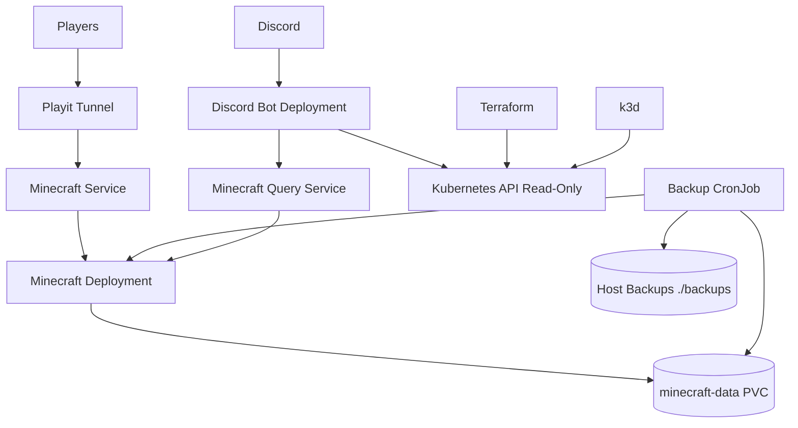

# Architecture

MineOps runs a Minecraft platform on a local k3d Kubernetes cluster.

## System View

## Components

### k3d

`infra/k3d/local.yaml` defines the local Kubernetes cluster.

It provides:

- fixed Kubernetes API endpoint on `https://localhost:6550`
- Minecraft port mapping on `25565`
- local-path storage mount for PVC data
- host backup mount from `${MINEOPS_BACKUP_HOST_PATH}` to `/backups`

### Terraform

`infra/terraform/` manages the main Kubernetes runtime:

- namespace
- Minecraft PVC
- Minecraft Deployment and Service
- Minecraft Query Service
- Playit Secret shape and Deployment
- backup ServiceAccount, RBAC, ConfigMap, and CronJob

### Minecraft

Minecraft runs as a single-replica Deployment with `Recreate` strategy and a single `ReadWriteOnce` PVC.

The platform assumes exactly one Minecraft process writes world data at any time.

### Playit

Playit runs as a separate Deployment and receives its secret key from `playit-secret`.

### Discord Bot

The Discord bot runs as a separate Deployment under `apps/discord-bot`.

It is read-only:

- reads Kubernetes status through a namespace-scoped ServiceAccount
- reads player information through the Minecraft Query Protocol
- does not execute infrastructure actions
- does not run Terraform or kubectl commands from Discord
- does not mutate Minecraft state

### Backups

Backups run from `cronjob/minecraft-backup`.

The backup flow:

1. Broadcast in-game warning.
2. Run `save-all`.
3. Run `save-off`.
4. Copy world/config data.
5. Run `save-on`.
6. Broadcast success or failure.

Backups are stored under `/backups` inside the cluster node, mapped to repository root `./backups` on the host.

## Security Boundaries

- Real secrets are loaded from local `.env` into Kubernetes Secrets.
- Secrets are not committed to Git.
- The Discord bot has read-only Kubernetes RBAC.
- The backup ServiceAccount has only the minimum permissions needed to locate the Minecraft pod and send console commands for backup consistency.
- Backup automation is Kubernetes-managed, not Discord-triggered.
