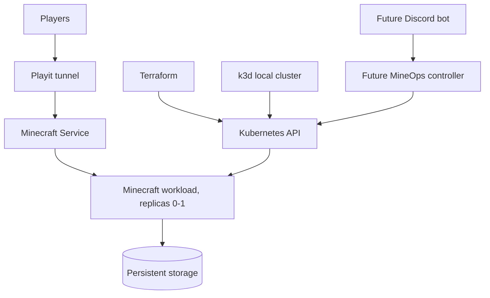

# MineOps Architecture

MineOps is a ChatOps-driven Minecraft platform for a local Kubernetes homelab. V1 establishes the repository foundation and keeps the current Docker Compose deployment available as a preserved legacy source.

## Target Shape

## Repository Areas

- `legacy/` contains preserved historical deployments and data sources.
- `infra/` contains local cluster and Terraform foundations.
- `platform/` contains future Kubernetes, Helm, and manifest resources.
- `docs/` contains operator and migration documentation.
- `.github/workflows/` contains CI foundations.

## Minecraft Workload Model

Minecraft should be treated as a single-writer stateful service with replicas limited to `0` or `1`.

A StatefulSet can be appropriate later because it gives stable identity and persistent volume ownership. A Deployment can also work if the PVC is explicitly single-writer and replicas are never greater than one. For MineOps V1, the key architectural rule is not the Kubernetes controller type; it is that exactly one Minecraft server process may mount and write the world data.

Default future recommendation: use a single-replica StatefulSet when implementing the real workload, but keep scale operations constrained to `0` or `1`.
