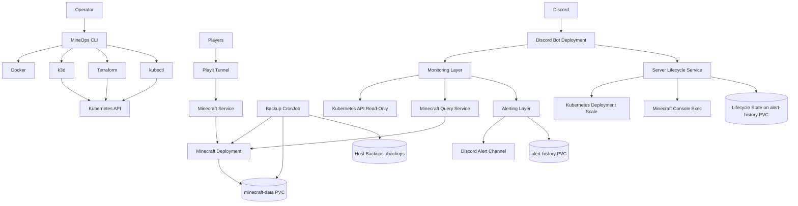

# Architecture

MineOps runs a Minecraft platform on a local k3d Kubernetes cluster.

## System View



## Operator Layer

`apps/mineops-cli` provides a single operator entrypoint:

```powershell
.\mineops.ps1 <command>
```

The CLI wraps Docker, k3d, Terraform, kubectl, backup, restore, status, playit tunnel diagnostics, logs, doctor, metrics, dashboard, events, and alerts workflows.

Playit is a primary runtime component. Friends connect through the Playit address, so MineOps health treats the public join path as healthy only when both are true:

- the `playit` Deployment has ready replicas
- the `minecraft` Service has at least one endpoint behind it

The Playit pod includes a `minecraft-local-proxy` sidecar. It listens on the Playit pod's `127.0.0.1:25565` and forwards to the Kubernetes `minecraft:25565` Service. This keeps existing Playit account tunnels that target `127.0.0.1:25565` working after moving Minecraft into Kubernetes.

### CLI Internal Architecture

```text
apps/mineops-cli/src/
  commands/        command registry entries and command metadata
  services/        application services and platform workflows
  domain/          platform error types
  infrastructure/  adapters for kubectl, Terraform, Docker, k3d, and env files
  ui/              terminal formatting helpers
```

Command handlers should stay presentation-oriented. Kubernetes reads, backup inventory, alert persistence, and lifecycle operations belong in services and infrastructure adapters.

Deployment follows the same rule. `mineops init` delegates to `DeploymentOrchestrator`, which coordinates focused services:

```text
init command
  -> DeploymentOrchestrator
  -> RequirementValidator
  -> ClusterManager
  -> EnvironmentManager
  -> ImageBuilder
  -> DeploymentManager
  -> HealthChecker
```

Each deployment step is idempotent: existing clusters are reused, unchanged images are skipped, Terraform and Kubernetes resources are reconciled, and existing Minecraft runtime metadata is preserved unless an explicit update command changes it.

## Discord Bot

The Discord bot has two surfaces:

- operational visibility commands
- controlled lifecycle commands

- reads Kubernetes status through namespace-scoped RBAC
- reads Playit Deployment and Minecraft Service endpoint status
- reads player information through Minecraft Query Protocol
- sends Discord embeds for slash commands
- evaluates alerts
- writes alert history to its PVC
- starts/stops/restarts only the Minecraft Deployment through the lifecycle service
- does not run Terraform from Discord
- does not expose arbitrary kubectl execution
- does not expose arbitrary Minecraft commands

Discord command handlers use the same separation:

```text
Discord slash command
  -> embed presentation
  -> MineOpsPlatformService
  -> Kubernetes status provider / Minecraft query provider / platform state store
```

Lifecycle commands route through:

```text
Discord slash command
  -> MineOpsPlatformService
  -> AdminAuthorizationService
  -> ServerLifecycleService
  -> OperationLockService
  -> KubernetesStatusProvider
```

## Monitoring Layer

The lightweight monitoring layer observes Kubernetes readiness, backup Job state, last backup age, backup duration, Minecraft query data, and cluster state.

Current implementation:

- `MetricsProvider`
- `KubernetesMetricsProvider`

## Alerting Layer

Alerting supports Discord delivery, durable history, maintenance state, and activity events.

Current implementation:

- `AlertProvider`
- `DiscordAlertProvider`
- `AlertHistoryStore`
- `PlatformStateStore`

Operational data is persisted to the `alert-history` PVC mounted at:

```text
/app/data
```

Stored data:

- `/app/data/alerts/alerts.jsonl`
- `/app/data/events/events.jsonl`
- `/app/data/maintenance/state.json`
- `/app/data/lifecycle/state.json`
- `/app/data/lifecycle/lock.json`

## Backups

Backups run from `cronjob/minecraft-backup` and are stored under `/backups`, mapped to repository root `./backups` on the host.

## Restore

Restore remains a manual administrative operation through the CLI or `scripts/restore.ps1`.

Restore is intentionally not exposed through Discord.

## Security Boundaries

- Real secrets are loaded from local `.env` into Kubernetes Secrets.
- Secrets are not committed to Git.
- The Discord bot has constrained namespace-scoped Kubernetes RBAC.
- Backup automation is Kubernetes-managed, not Discord-triggered.
- Restore operations are manual operator procedures outside Discord.
- Discord lifecycle permissions are controlled by `mineops-admins.json`, not Discord roles.
- `/start_server` is open to all Discord users.
- `/stop_server` and `/restart_server` require the MineOps admin allow-list.
- Lifecycle RBAC is namespace-scoped and limited to the Minecraft Deployment, its scale subresource, and pod exec for Minecraft console safety commands.
- No Discord command can run Terraform, arbitrary kubectl, arbitrary pod exec, backup restore, or arbitrary Minecraft commands.

## Phase 7 Extension Points

Phase 7 can add Prometheus, Grafana, and Alertmanager-backed implementations behind the existing provider interfaces without changing the CLI or Discord command UX contract.
