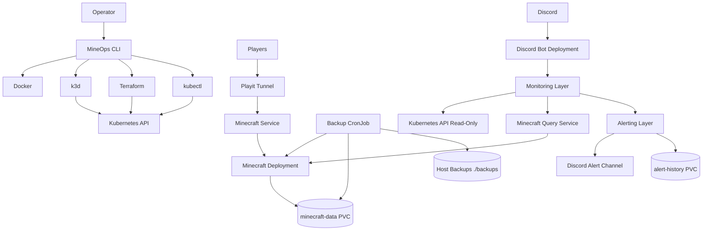

# Architecture

MineOps runs a Minecraft platform on a local k3d Kubernetes cluster.

## System View



## Operator Layer

`apps/mineops-cli` provides a single operator entrypoint:

```powershell
.\mineops.ps1 <command>
```

The CLI wraps Docker, k3d, Terraform, kubectl, backup, restore, status, logs, doctor, metrics, dashboard, events, and alerts workflows.

## Discord Bot

The Discord bot is read-only:

- reads Kubernetes status through namespace-scoped RBAC
- reads player information through Minecraft Query Protocol
- sends Discord embeds for slash commands
- evaluates alerts
- writes alert history to its PVC
- does not execute infrastructure actions
- does not run Terraform or kubectl commands from Discord
- does not mutate Minecraft state

## Monitoring Layer

The lightweight monitoring layer observes Kubernetes readiness, backup Job state, last backup age, backup duration, Minecraft query data, and cluster state.

Current implementation:

- `MetricsProvider`
- `KubernetesMetricsProvider`

## Alerting Layer

Alerting supports Discord delivery, durable history, maintenance state, and activity events.

Current implementation:

- `AlertProvider`
- `DiscordAlertProvider`
- `AlertHistoryStore`

Operational data is persisted to the `alert-history` PVC mounted at:

```text
/app/data
```

Stored data:

- `/app/data/alerts/alerts.jsonl`
- `/app/data/events/events.jsonl`
- `/app/data/maintenance/state.json`

## Backups

Backups run from `cronjob/minecraft-backup` and are stored under `/backups`, mapped to repository root `./backups` on the host.

## Restore

Restore remains a manual administrative operation through the CLI or `scripts/restore.ps1`.

Restore is intentionally not exposed through Discord.

## Security Boundaries

- Real secrets are loaded from local `.env` into Kubernetes Secrets.
- Secrets are not committed to Git.
- The Discord bot has read-only Kubernetes RBAC.
- Backup automation is Kubernetes-managed, not Discord-triggered.
- Restore operations are manual operator procedures outside Discord.
- No Discord command can run Terraform, kubectl, pod exec, or infrastructure mutation.

## Phase 6 Extension Points

Phase 6 can add Prometheus, Grafana, and Alertmanager-backed implementations behind the existing provider interfaces without changing the CLI or Discord command UX contract.
