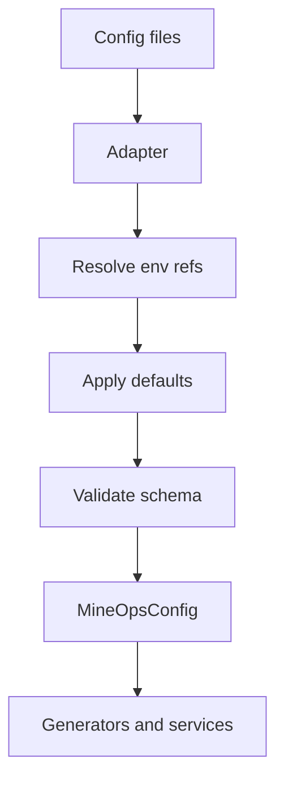

# Configuration System

MineOps uses a strict configuration boundary.

## Flow

## Adapters

Current adapters:

- `MineOpsYamlAdapter`
- `LegacyConfigAdapter`

Both produce the same raw MineOps-shaped data before schema validation and domain object construction.

## Why Adapters Exist

Adapters isolate file formats from the rest of the platform.

Without them:

- infrastructure code would need to know about YAML structure
- migration from legacy files would leak across the codebase
- tests would be harder to drive with synthetic config

## Why Infrastructure No Longer Reads YAML

Infrastructure is a consumer, not a source of truth.

Terraform, bootstrap scripts, and manifests receive generated artifacts because:

- desired state has already been validated
- environment-variable resolution has already happened
- deployment inputs are explicit and deterministic
- file-format knowledge stays at the edge

## Immutability

`MineOpsConfig`, `InstanceConfig`, and `PlatformServiceConfig` are deep-frozen after construction.

This prevents accidental mutation inside commands or services and keeps planning deterministic.

## Validation

MineOps validates before infrastructure work:

- required files and required fields
- namespaces
- cron expressions
- CPU, memory, and storage quantities
- uniqueness of instance names and namespaces

This is fail-fast validation, not best-effort deployment.

## Generated Inputs

From config, MineOps currently generates:

- Terraform variables
- runtime secret/config artifacts
- Discord bot manifests

## Related

- [ADR 0001](../adr/0001-mineops-config-as-ssot.md)
- [Configuration Adapters](../developer-guide/configuration-adapters.md)
