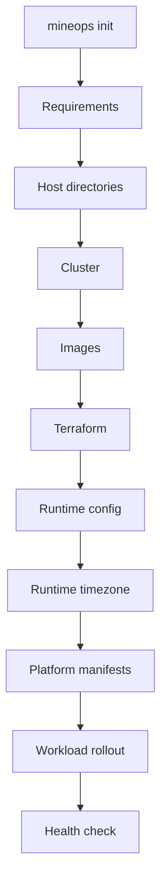

# Deployment Pipeline

`mineops init` is the platform reconciliation entrypoint.

## Deployment Flow

## Current Orchestrator

`DeploymentOrchestrator` coordinates:

- `RequirementValidator`
- `EnvironmentManager`
- `ClusterManager`
- `ImageBuilder`
- `DeploymentManager`
- `HealthChecker`

## What Each Step Does

### Requirements

Checks:

- supported OS
- required commands
- Docker access

### Host Directories

Ensures host storage and backup paths exist, including per-instance backup directories.

### Cluster

Creates the k3d cluster only if it does not already exist.

### Images

Builds and loads the Discord bot image only when its fingerprint changes.

### Terraform

Generates per-instance `terraform.tfvars.json`, initializes Terraform, and applies infrastructure for each instance.

### Runtime Config

Generates per-instance runtime artifacts, then applies Secrets and ConfigMaps through `bootstrap-secrets.ps1`.

### Platform Manifests

Generates the Discord bot manifest and applies it with `kubectl`.

### Workload Rollout

Waits for:

- `minecraft`
- `playit`
- `discord-bot`

### Health Check

Confirms per-instance readiness across Minecraft, Playit, Discord, and backup CronJob presence.

## Idempotency

The pipeline is deterministic and repeatable:

- existing clusters are reused
- unchanged images are skipped
- unchanged runtime artifacts do not change the fingerprint
- Terraform is reconciled from generated vars
- manifests are re-applied safely

## Related

- [Configuration System](configuration-system.md)
- [Infrastructure](infrastructure.md)
