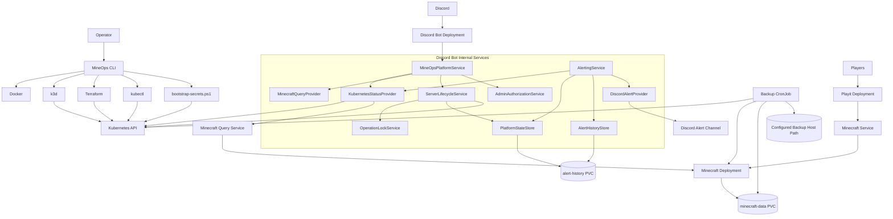

# Overall System View

This document shows the MineOps platform as it is currently implemented: operator workflows, infrastructure control paths, player traffic, backup flows, and the Discord bot's internal runtime responsibilities.

MineOps is not just a deployment wrapper. The CLI is the operator control plane for a platform that provisions Kubernetes resources, injects generated runtime artifacts, and operates multiple cooperating services around Minecraft.

## System Diagram

## What This Diagram Represents

This is a current-implementation system view, not a purely conceptual platform sketch.

It distinguishes between:

- operator-side executors such as Terraform, `kubectl`, and `bootstrap-secrets.ps1`
- deployed runtime components such as Minecraft, Playit, the backup CronJob, and the Discord bot
- internal bot services that run inside the Discord bot deployment

## 1. Operator Control Path

The operator interacts with MineOps through the CLI.

The CLI drives:

- `Docker` for Discord bot image build and image inspection
- `k3d` for cluster lifecycle
- `Terraform` for core platform infrastructure
- `kubectl` for operational commands, manifest application, rollout checks, and status reads
- `bootstrap-secrets.ps1` for applying generated runtime Secrets and ConfigMaps

All infrastructure mutation ultimately flows through the Kubernetes API.

That matches the current implementation:

- Terraform creates the main Kubernetes runtime resources
- generated runtime artifacts are applied with `bootstrap-secrets.ps1`
- generated Discord manifests are applied with `kubectl`
- CLI day-2 commands also use `kubectl`

Related:

- [Deployment Pipeline](deployment-pipeline.md)
- [Infrastructure](infrastructure.md)
- [Configuration System](configuration-system.md)

## 2. Player Traffic Path

Players reach Minecraft through the Playit deployment.

The runtime path is:

1. player traffic reaches Playit
2. Playit forwards to the Minecraft Kubernetes service
3. the service routes traffic to the Minecraft deployment
4. Minecraft reads and writes world state through `minecraft-data` PVC

This is why public reachability is evaluated as a composed condition. The current code treats the path as ready only when:

- Playit deployment readiness is healthy
- Minecraft service endpoints exist

Related:

- [Networking](networking.md)
- [Runtime](runtime.md)
- [Storage](storage.md)

## 3. Backup And Persistence Path

The backup CronJob is a deployed runtime component managed by Terraform.

It currently interacts with:

- the Kubernetes API
- the Minecraft runtime
- the `minecraft-data` PVC
- a configured host-backed backup path mounted into the cluster at `/backups`

This is more accurate than describing backups as always writing to `./backups`. The actual host path is configurable and may be per-instance.

The main storage split is:

- `minecraft-data PVC` for live world state
- configured host backup storage for restore points
- `alert-history PVC` for Discord bot operational history and lifecycle state

Related:

- [Storage](storage.md)
- [Backup And Restore](../operator-guide/backup-and-restore.md)

## 4. Discord Bot Runtime Path

The Discord bot is one deployment with multiple internal services.

Those internal services are not separate Kubernetes deployments. They run inside the bot process and collaborate through injected providers and persistent state.

### Status And Visibility

The current status path is centered on:

- `MineOpsPlatformService`
- `KubernetesStatusProvider`
- `MinecraftQueryProvider`

These components provide:

- deployment and pod status
- Playit readiness
- backup state visibility
- player information through the Minecraft Query service

### Lifecycle Control

The current lifecycle path is centered on:

- `MineOpsPlatformService`
- `AdminAuthorizationService`
- `ServerLifecycleService`
- `OperationLockService`
- `PlatformStateStore`

Those components coordinate:

- permission checks for admin-only Discord actions
- scale-up and scale-down through the Kubernetes API
- constrained Minecraft console exec operations through the Kubernetes API
- lifecycle locking and state persistence

### Alerting

The current alerting path is centered on:

- `AlertingService`
- `AlertHistoryStore`
- `PlatformStateStore`
- `DiscordAlertProvider`

These components:

- evaluate monitoring signals
- persist alert and event history
- persist maintenance and lifecycle state
- publish alerts to a configured Discord alert channel

Related:

- [Runtime](runtime.md)
- [Service Descriptors](service-descriptors.md)
- [Day-2 Operations](../operator-guide/day-2-operations.md)

## 5. Kubernetes API As The Runtime Hub

The earlier diagram version split Kubernetes reads and writes into separate nodes. The implementation is simpler than that.

MineOps currently uses one Kubernetes API as the central runtime surface for:

- Terraform resource reconciliation
- CLI operational reads and writes
- runtime secret/config application
- Discord bot status reads
- Discord bot lifecycle writes
- backup job coordination

The real distinction is not different APIs. It is different clients and permission scopes using the same API.

## Instance-Aware Interpretation

This diagram shows one logical MineOps instance.

In a multi-instance deployment, the same structure is repeated per instance with:

- one namespace per instance
- one Minecraft deployment per instance
- one Playit deployment per instance
- one Discord bot deployment per instance
- one backup CronJob per instance
- one `minecraft-data` PVC per instance
- one `alert-history` PVC per instance

Resource names stay stable inside a namespace, while namespace isolation and instance labels separate instances.

Related:

- [Overview](overview.md)
- [Multi-instance](../user-guide/multi-instance.md)

## Design Implications

This system view reflects the current architecture decisions:

- MineOps is a platform, not a script.
- The CLI is the operator control plane.
- Kubernetes is the runtime substrate.
- Terraform, `kubectl`, and `bootstrap-secrets.ps1` are executors, not sources of truth.
- The Discord bot is one deployment with internal operational subsystems.
- Storage and recovery are explicit and instance-scoped.
- Operational permissions are intentionally constrained.

## Related Documents

- [Overview](overview.md)
- [Deployment Pipeline](deployment-pipeline.md)
- [Infrastructure](infrastructure.md)
- [Runtime](runtime.md)
- [Storage](storage.md)
- [Networking](networking.md)
