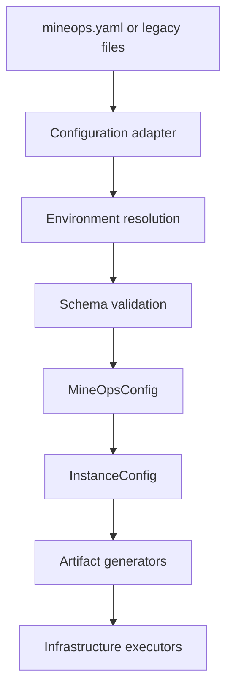
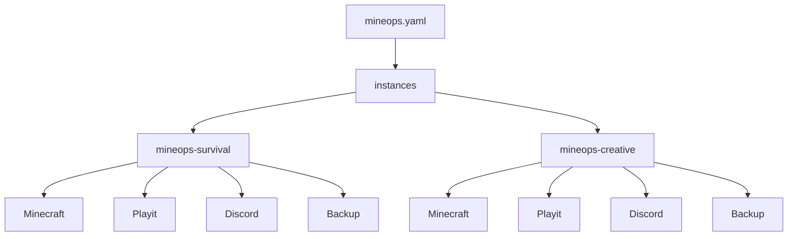

# Architecture Overview

MineOps is a platform composed of configuration adapters, immutable domain config, artifact generators, infrastructure executors, and runtime services.

## Core Model

## Why `MineOpsConfig` Exists

`MineOpsConfig` gives MineOps one internal representation of desired state regardless of where the input came from.

That matters because:

- deployment code should not care whether the user used `mineops.yaml` or legacy files
- validation should happen before infrastructure mutation
- infrastructure components should consume explicit inputs, not rediscover configuration themselves
- multi-instance behavior should be represented as data, not implicit branching

## Multi-Instance Architecture

Each instance gets its own namespace while reusing stable in-namespace resource names.

## Layering

- Adapters read external inputs.
- Schema and domain config validate and freeze them.
- Generators derive Terraform vars, runtime artifacts, and manifests.
- Executors run Terraform, `kubectl`, k3d, and PowerShell scripts.
- Runtime services expose platform behavior through the CLI and Discord bot.

## Related

- [Configuration System](configuration-system.md)
- [Deployment Pipeline](deployment-pipeline.md)
- [Infrastructure](infrastructure.md)
